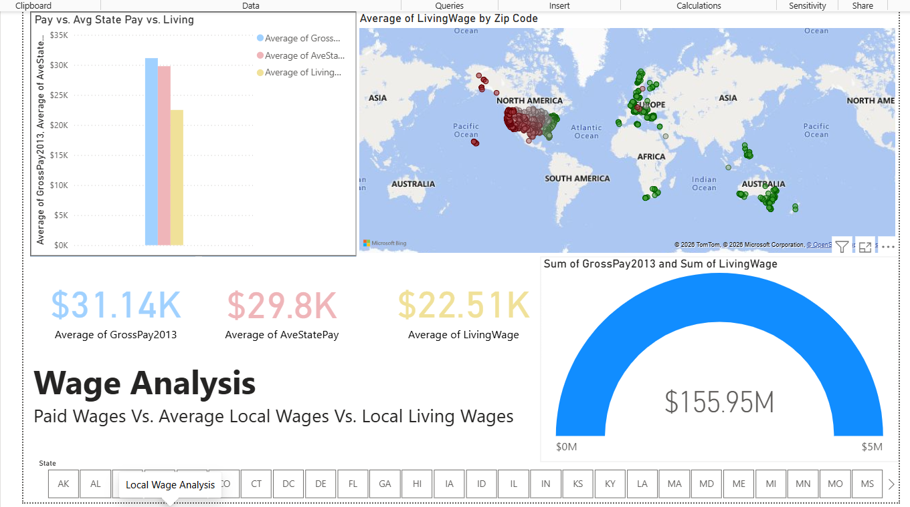

# 💰 Local Wage Analysis Dashboard

An interactive Power BI dashboard comparing employee gross pay against average state wages and local living wages across the United States.

## 🔍 Dashboard Preview



## 📊 Key Metrics

| Metric | Value |
|--------|-------|
| **Average Gross Pay (2013)** | $31.14K |
| **Average State Pay** | $29.8K |
| **Average Living Wage** | $22.51K |
| **Total Gross Pay** | $155.95M |

## 📈 Visualizations

- 📊 **Clustered Column Chart** — Pay vs. Average State Pay vs. Living Wage comparison
- 🗺️ **Interactive Map** — Average Living Wage by ZIP Code across the US
- 💳 **KPI Cards** — At-a-glance metrics for Gross Pay, State Pay, and Living Wage
- 📐 **Gauge Chart** — Total compensation ($155.95M) against benchmarks
- 🎛️ **State Slicer** — Filter data by any US state (AK through WY)

## 💡 Key Insights

1. **Employees earn above the living wage** — Average gross pay ($31.14K) exceeds the average living wage ($22.51K) by ~38%
2. **Pay closely tracks state averages** — Gross pay ($31.14K) is within 5% of average state pay ($29.8K)
3. **Geographic concentration** — Most employees are located in the eastern United States, with clusters around major metro areas
4. **Living wage varies significantly** — The map reveals substantial regional differences in cost of living across ZIP codes

## 🛠️ Tools & Technologies

| Tool | Purpose |
|------|---------|
| **Power BI Desktop** | Data modeling & visualization |
| **DAX** | Calculated measures and KPIs |
| **Power Query (M)** | Data transformation & cleansing |

## 📁 Data Model

```
Employees (Single Table)
├── GrossPay2013    — Employee gross pay
├── AveStatePay     — Average pay for the state
├── LivingWage      — Local living wage
├── State           — US state
└── Zip Code        — ZIP code for geo-mapping
```

## 🚀 How to Use

1. Download [`Wage_Analysis.pbix`](Wage_Analysis.pbix)
2. Open in [Power BI Desktop](https://powerbi.microsoft.com/desktop/) (free)
3. Use the **State slicer** at the bottom to filter by any US state
4. Hover over map markers to see ZIP-level living wage details
5. Click on chart bars to cross-filter other visuals

## 👤 Author

**Samridhi Tyagi** — Data Analyst  
[LinkedIn](https://www.linkedin.com/in/samridhi-tyagi-300244267/) • [GitHub](https://github.com/samjkk)

---

> *Built with Power BI Desktop • Employee compensation and living wage dataset*
